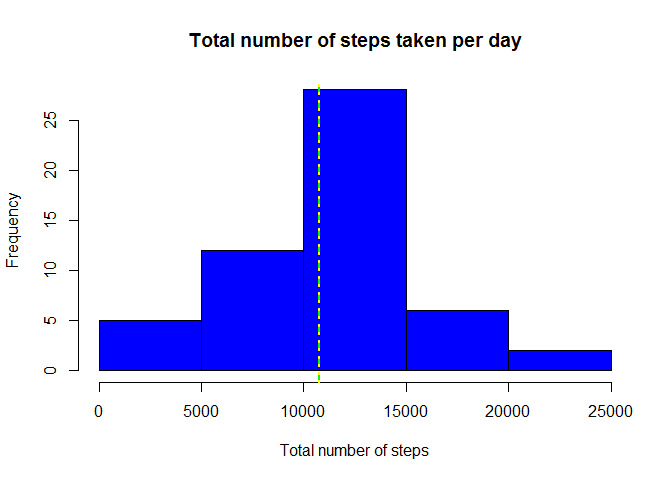
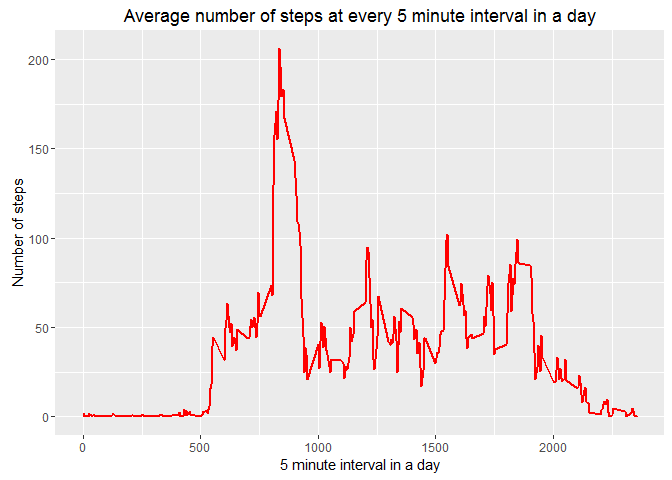
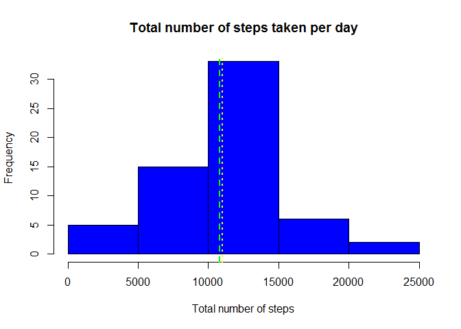
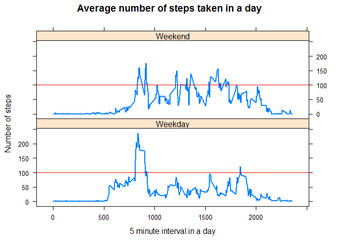

# Reproducible Research: Peer Assessment 1

by Chan Chee-Foong on 14 Apr 2016

***
### Libraries required
- lubridate
- dplyr
- ggplot2
- lattice
- knitr
- markdown
- rmarkdown


***
## Loading and preprocessing the data

1. Download the zip file if it is not found in the working directory and unzip the file for analysis.


```r
datadir <- "./activity"
datafile <- "activity.csv"
zipfile <- "activity.zip"

datadirfile <- paste(datadir, datafile, sep="/")
zipdirfile <- paste(datadir, zipfile, sep="/")

if (!file.exists(datadirfile)) {
    dir.create(datadir)
    url <- "https://d396qusza40orc.cloudfront.net/repdata%2Fdata%2Factivity.zip"
    download.file(url, destfile = zipdirfile, mode = 'wb')
    unzip (zipdirfile, exdir = datadir)
}
```

2. Load the csv file in to myData dataframe.  Update the date to the date class.  Update the interval to factor class.


```r
myData <- read.csv(datadirfile, header = TRUE, na.strings = 'NA')
myData$date <- ymd(myData$date)
myData$interval <- as.factor(myData$interval)
```

3. Check data loaded


```r
str(myData)
```

```
## 'data.frame':	17568 obs. of  3 variables:
##  $ steps   : int  NA NA NA NA NA NA NA NA NA NA ...
##  $ date    : POSIXct, format: "2012-10-01" "2012-10-01" ...
##  $ interval: Factor w/ 288 levels "0","5","10","15",..: 1 2 3 4 5 6 7 8 9 10 ...
```

```r
summary(myData)
```

```
##      steps             date               interval    
##  Min.   :  0.00   Min.   :2012-10-01   0      :   61  
##  1st Qu.:  0.00   1st Qu.:2012-10-16   5      :   61  
##  Median :  0.00   Median :2012-10-31   10     :   61  
##  Mean   : 37.38   Mean   :2012-10-31   15     :   61  
##  3rd Qu.: 12.00   3rd Qu.:2012-11-15   20     :   61  
##  Max.   :806.00   Max.   :2012-11-30   25     :   61  
##  NA's   :2304                          (Other):17202
```

```r
head(myData)
```

```
##   steps       date interval
## 1    NA 2012-10-01        0
## 2    NA 2012-10-01        5
## 3    NA 2012-10-01       10
## 4    NA 2012-10-01       15
## 5    NA 2012-10-01       20
## 6    NA 2012-10-01       25
```

***
## What is mean total number of steps taken per day?

Use dplyr library to group and summarise data.  Then calculate and show the mean and median.  

- *Notes: Could have used **aggregate** function here.  *


```r
totalByDay <- myData[!is.na(myData$steps),] %>% group_by(date) %>% summarise(total = sum(steps))

head(totalByDay)
```

```
## Source: local data frame [6 x 2]
## 
##         date total
##       (time) (int)
## 1 2012-10-02   126
## 2 2012-10-03 11352
## 3 2012-10-04 12116
## 4 2012-10-05 13294
## 5 2012-10-06 15420
## 6 2012-10-07 11015
```

```r
hist(totalByDay[!is.na(totalByDay$total),]$total, breaks = 5, col = 'blue', xlab = 'Total number of steps', main = 'Total number of steps taken per day')

myMean <- round(mean(totalByDay[!is.na(totalByDay$total),]$total),0)
myMedian <- median(totalByDay[!is.na(totalByDay$total),]$total)
abline(v=myMean, lwd = 2, lty= 2, col = 'green')
abline(v=myMedian, lwd = 2, lty= 3, col = 'yellow')
```



```r
myMean
```

```
## [1] 10766
```

```r
myMedian
```

```
## [1] 10765
```

Mean and median of total number of steps taken per day are <span style="color:red">**10766**</span> and <span style="color:red">**10765**</span> respectively.

***
## What is the average daily activity pattern?

Use dplyr library to group and summarise data.  Then plot the mean number of steps every 5 minute interval throughout a day. 


```r
meanByInterval <- myData[!is.na(myData$steps),] %>% group_by(interval) %>% summarise(mean = mean(steps))
meanByInterval <- meanByInterval[!is.na(meanByInterval$mean),]
meanByInterval$interval <- as.numeric(as.character(meanByInterval$interval))

head(meanByInterval)
```

```
## Source: local data frame [6 x 2]
## 
##   interval      mean
##      (dbl)     (dbl)
## 1        0 1.7169811
## 2        5 0.3396226
## 3       10 0.1320755
## 4       15 0.1509434
## 5       20 0.0754717
## 6       25 2.0943396
```

```r
ggplot(data=meanByInterval, aes(x=interval, y=mean)) + 
geom_line(size = 1, col = 'red') + 
xlab("5 minute interval in a day") + ylab("Number of steps") + 
ggtitle("Average number of steps at every 5 minute interval in a day")
```



```r
myMax <- meanByInterval[meanByInterval$mean == max(meanByInterval$mean),]

myMax
```

```
## Source: local data frame [1 x 2]
## 
##   interval     mean
##      (dbl)    (dbl)
## 1      835 206.1698
```

The 5 minute interval of <span style="color:red">**835**</span> contains the maximum mean number of steps of <span style="color:red">**206**</span>


***
## Imputing missing values

Study the NA values by considering the following:  

- How many NA values are there?  
- On which days are there NA values?  
- Are these NA values occuring on days with values?  


```r
countNA <- nrow(myData[is.na(myData$steps),])
countNA
```

```
## [1] 2304
```

```r
unique(myData[is.na(myData$steps),]$date)
```

```
## [1] "2012-10-01 UTC" "2012-10-08 UTC" "2012-11-01 UTC" "2012-11-04 UTC"
## [5] "2012-11-09 UTC" "2012-11-10 UTC" "2012-11-14 UTC" "2012-11-30 UTC"
```

```r
myData[!is.na(myData$steps) & myData$date %in% unique(myData[is.na(myData$steps),]$date),]
```

```
## [1] steps    date     interval
## <0 rows> (or 0-length row.names)
```

- There is a total number of <span style="color:red">**2304**</span> rows with NAs in the dataset.  
- NA values occur only on 8 dates.
- On these 8 dates, all the steps values are NA.  

**Decision on imputing logic:**  
- The missing values are imputed based on the mean number of steps specific to weekday and interval.  
- The means are calculated based only on data with steps values.  

**Steps:**   
1. Mean number of steps specific to weekday and interval are calculated and populated in **meanByIntnDay**    
2. Merge with **myData** to form **myNewData**  
3. Populate the missing NA values  
4. Use dplyr library to group and summarise data.  
5. Plot the histogram


```r
myData$day <- wday(myData$date, label=TRUE)
meanByIntnDay <- myData[!is.na(myData$steps),] %>% group_by(interval, day) %>% summarise(mean = mean(steps))
myNewData <- merge(myData, meanByIntnDay,by = c('interval','day'))
myNewData[is.na(myNewData$steps),]$steps <- myNewData[is.na(myNewData$steps),]$mean
myNewData$interval <- as.numeric(as.character(myNewData$interval))

head(myNewData)
```

```
##   interval day steps       date mean
## 1        0 Fri     0 2012-10-19    0
## 2        0 Fri     0 2012-10-05    0
## 3        0 Fri     0 2012-11-30    0
## 4        0 Fri     0 2012-10-12    0
## 5        0 Fri     0 2012-11-16    0
## 6        0 Fri     0 2012-10-26    0
```

```r
newTotalByDay <- myNewData[!is.na(myNewData$steps),] %>% group_by(date) %>% summarise(total = sum(steps))

head(newTotalByDay)
```

```
## Source: local data frame [6 x 2]
## 
##         date     total
##       (time)     (dbl)
## 1 2012-10-01  9974.857
## 2 2012-10-02   126.000
## 3 2012-10-03 11352.000
## 4 2012-10-04 12116.000
## 5 2012-10-05 13294.000
## 6 2012-10-06 15420.000
```

```r
hist(newTotalByDay[!is.na(newTotalByDay$total),]$total, breaks = 5, col = 'blue', xlab = 'Total number of steps', main = 'Total number of steps taken per day')

myNewMean <- round(mean(newTotalByDay[!is.na(newTotalByDay$total),]$total),0)
myNewMedian <- median(newTotalByDay[!is.na(newTotalByDay$total),]$total)

abline(v=myNewMean, lwd = 2, lty= 2, col = 'green')
abline(v=myNewMedian, lwd = 2, lty= 3, col = 'yellow')
```



```r
myNewMean
```

```
## [1] 10821
```

```r
myNewMedian
```

```
## [1] 11015
```

Mean and median of total number of steps taken per day are <span style="color:red">**10821**</span> and <span style="color:red">**11015**</span> respectively.  
Before imputing the missing values, the mean and median are closed to each other.  After imputing the missing values, the mean and median are quite different as observed on the histograms.


***
## Are there differences in activity patterns between weekdays and weekends?

Additional field **daytype** was created to separate the data into 2 groups.  Sat and Sun defined as weekends and the rest of the days as weekdays.


```r
myNewData$daytype <- as.factor(ifelse(myNewData$day %in% c('Sat','Sun'),'Weekend','Weekday'))

head(myNewData)
```

```
##   interval day steps       date mean daytype
## 1        0 Fri     0 2012-10-19    0 Weekday
## 2        0 Fri     0 2012-10-05    0 Weekday
## 3        0 Fri     0 2012-11-30    0 Weekday
## 4        0 Fri     0 2012-10-12    0 Weekday
## 5        0 Fri     0 2012-11-16    0 Weekday
## 6        0 Fri     0 2012-10-26    0 Weekday
```

```r
meanByIntnDT <- myNewData[!is.na(myNewData$steps),] %>% group_by(interval,daytype) %>% summarise(mean = mean(steps))

head(meanByIntnDT)
```

```
## Source: local data frame [6 x 3]
## Groups: interval [3]
## 
##   interval daytype     mean
##      (dbl)  (fctr)    (dbl)
## 1        0 Weekday 2.310714
## 2        0 Weekend 0.000000
## 3        5 Weekday 0.450000
## 4        5 Weekend 0.000000
## 5       10 Weekday 0.175000
## 6       10 Weekend 0.000000
```

```r
with(meanByIntnDT, 
    xyplot(mean ~ interval | daytype, type= 'l', 
    layout = c(1,2),
    lwd = 2, 
    main = 'Average number of steps taken in a day',
    xlab = '5 minute interval in a day',
    ylab = 'Number of steps',
    panel = function(x,y,...) {
        panel.xyplot(x,y,...)
        panel.abline(h=100, col='red')
    }
    ))
```



Noticed that there differences in activity patterns between weekdays and weekends.  For weekdays, most activities occur earlier part of the day.  For weekends, activities occur throughout the day.


***
### End of Assignment - Thank you for your time reviewing my work.  Have a nice day!
